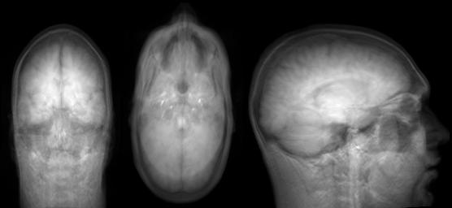
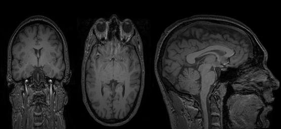
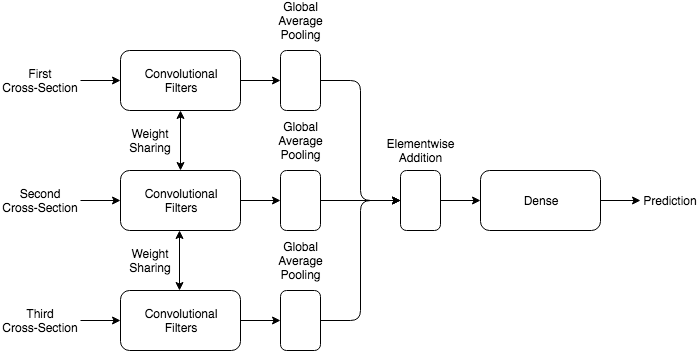

# MRI Deface Detector

The de-identification of Brain MRI (Magnetic Resonance Imaging) scans, which is an important ethical step while publicly sharing datasets, is called defacing. Defacing involves removing or masking the part of the image corresponding to the face, while simultaneously ensuring brain data is not lost in the process.

This javascript tool intends to serve a trained deep learning model to do the job of detecting deface in an MRI scan quickly and efficiently. The tool will be easy to integrate into automatic validators such as the [BIDS Validator](https://github.com/INCF/bids-validator).

## How to Run the Detector on your Browser

Using npm:

```
npm install
npm run watch
```

Upload a `NIFTI` file to see results.

Note : The existing model has been trained on the [IXI-Dataset](http://brain-development.org/ixi-dataset/), where [pydeface](https://github.com/poldracklab/pydeface) to create the corresponding defaced dataset.

## How to Run the Detector using Command Line

Coming Soon!

## Build your own Detector

The module has two components:

- Deep Learning Model(python)
- Deface Detector Tool (javascript)

### Deep Learning Model

#### Dataset Preparation

Dataset Structure : 

```
Dataset
│
└───Undefaced
│   │	image1.nii.gz 
│   │	image2.nii.gz 
│   │	...
│
└───Defaced
    │	image3.nii.gz 
    │	image4.nii.gz
    │	...
```

The three-dimensional MRI scan is preprocessed to obtain 3 two-dimensional cross-sections using one of mean or slice methods. Examples for each of the two are given below.

##### Mean
Arithmetic mean along each of the dimensions



##### Slice
Center slice along each of the dimensions



Note : The existing model uses `mean` preprocessing. The reasoning behind this is that the mean blurs out the intricate details of the neural parts, thus allowing the model to give emphasis to the actual shape of the structure, which is essential for deface detection.

For faster experimentation, the mri data is first stored as numpy(npz) files.

To do this run :

```
python load_dataset.py --load_path path/to/dataset1 path/to/dataset2 .. \
		       --save_path path/to/save/npz/files \
		       --preprocess [Optional] mean/slice
```

As this step takes substantial time due to big sizes of MRI scans, the script allows you keep appending more data as acquired to the numpy storage by just running `load_dataset` using the same `save_path` repeatedly.

#### Train the Model

To train the model :

```
python detector.py --load_path path/to/npz/files \
		   --augment_images False \
		   --export_js False
```

##### Export to JS
Set the `--export_js` flag to True for automatic conversion of the best model to a TensorFlowJS usable form.

##### Augmentations
Set the `--augment_images` to True to augment images, while training, using the transformations below:
- Gaussian Blur
- Contrast Normalization
- Multiply
- Flips
- Rotations

##### Model Architecture
The figure below represents the simplified model architecture:



Note : The weight sharing and elementwise addition features were used specifically to ensure the independence of model performance on the order in which the cross-sections are passed to the model, thus making it more robust.

### Deface Detector Tool

#### Port the Custom Model to Deface Detector

- The TensorFlowJS model consists of the model structure in the form a JSON file and the weights as shards saved in a `model_js` directory.
- Copy `model_js` into the `/public` folder
- Kick Start the detector!

## Next Steps

- Fix the NIFTI file read, which is corrupted right now.
- Implement mean preprocessing in javascript detector tool. 
- Make integratable into other validators.
- Run as a Node app
